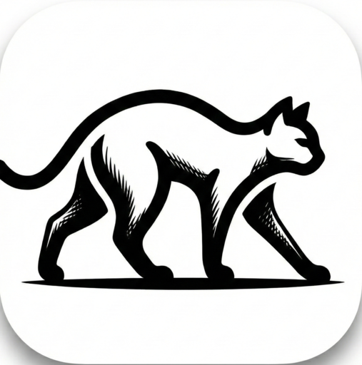
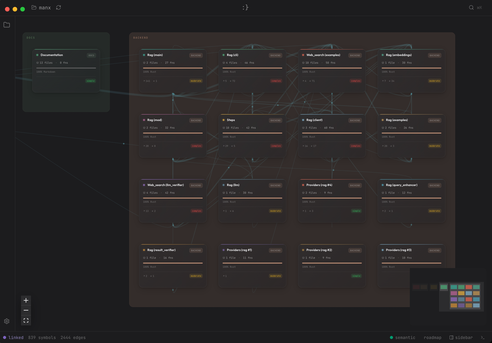
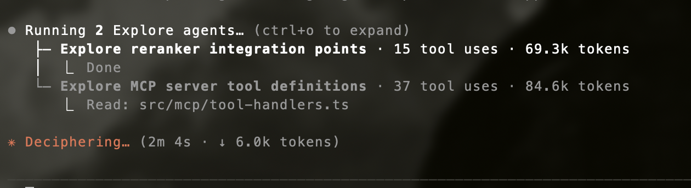
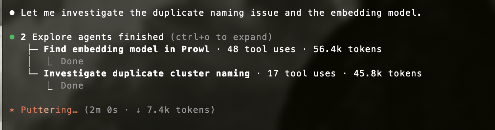
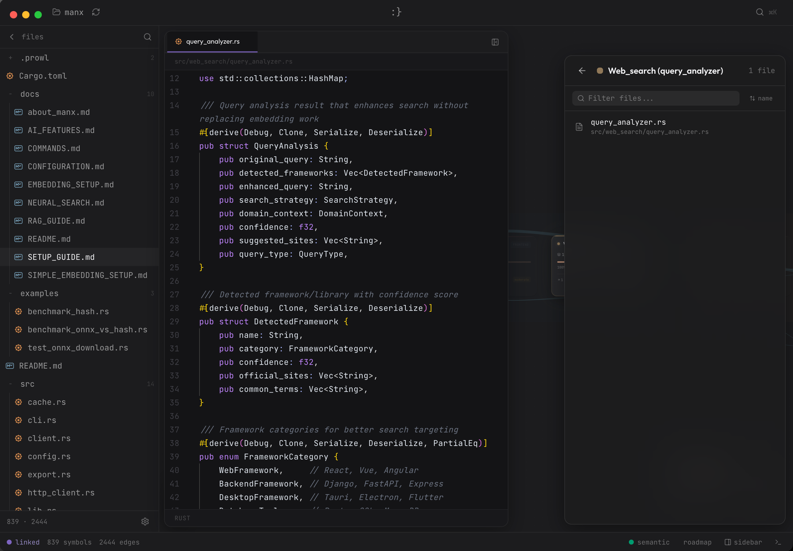

<div align="center">



# Prowl

**Your second monitor while AI writes the code.**

See what your AI coder is actually doing — a live visual map of your entire project that lights up as files change.

[](https://github.com/neur0map/prowl/releases)
[](#)
[](LICENSE)
[](https://nodejs.org)
[](https://github.com/neur0map/prowl/pulls)

<br />

### [Download for macOS (Apple Silicon)](https://github.com/neur0map/prowl/releases/latest) · [macOS (Intel)](https://github.com/neur0map/prowl/releases/latest) · [Windows](https://github.com/neur0map/prowl/releases/latest) · [Linux](https://github.com/neur0map/prowl/releases/latest)

<br />




</div>

---

## What is Prowl?

Prowl is a desktop app that sits next to your AI coding tool. You open your project, and Prowl builds an interactive map of every file, function, and connection. When your AI starts writing code, you watch the map update live.

**It works with any AI coder:** Claude Code, Cursor, Codex, Gemini CLI, Aider, Windsurf — anything that edits files.

**You don't need to be a programmer to use it.** If you can drag a folder onto an app, you can use Prowl.

---

## How It Works

```
1. Open your project folder in Prowl
         |
2. Prowl builds a visual map of your codebase
         |
3. Run your AI coder (in Prowl's terminal or your own)
         |
4. Watch files light up as they change
         |
5. Curious about something? Ask Prowl's chat
```

---

## Why You Need This

You're shipping with AI writing most of the code. Claude, Codex, or Gemini running in your terminal. Files appearing, changing, disappearing. You're watching text scroll by, hoping nothing breaks.

**Prowl gives you the picture.**

| Without Prowl | With Prowl |
|---------------|------------|
| Staring at terminal output, guessing what changed | See files light up on a map in real time |
| Asking your AI coder "what does this file do?" (wasting tokens) | Ask Prowl instead — it knows your whole codebase |
| Searching through folders for "the thing that handles login" | The map shows connections, the chat finds it instantly |
| No idea if the AI broke something | See which files were touched and how they connect |
| Want to look at a GitHub repo before cloning | Paste the URL into Prowl and browse it visually |

---

## Features

- **Live graph** — Your entire project as an interactive map. Nodes light up as files change.
- **Built-in terminal** — Run Claude Code, Aider, or any tool right inside Prowl.
- **Ask questions** — Chat about your codebase without burning tokens in your main AI.
- **Conversation history** — Chat sessions persist across restarts. Context auto-compacts so you never hit the limit.
- **Code viewer** — Click any node to read the code. Edit if you need to.
- **GitHub import** — Paste a repo URL to explore it without cloning.
- **Smart search** — Find code by meaning, not just keywords.
- **Snapshot restore** — Re-open projects instantly. Git-aware incremental updates re-index only what changed.
- **Multi-language** — JavaScript, TypeScript, Python, Java, Go, Rust, C, C++, C# — with full support for structs, enums, traits, impls, macros, and more.
- **Works offline** — Everything runs locally on your machine. No data leaves your computer.
- **⚡ MCP Server** — Your AI coder queries Prowl's knowledge graph instead of reading hundreds of files. One tool call instead of thirty. **~98% fewer tokens.** Big codebases benefit the most. [Details below →](#mcp-let-your-ai-coder-use-prowls-brain)

---

## MCP: Let Your AI Coder Use Prowl's Brain

<div align="center">

**Prowl has a built-in [Model Context Protocol](https://modelcontextprotocol.io) server.**

Your AI coding agent (Claude Code, Cursor, etc.) connects to Prowl and queries the knowledge graph directly — instead of reading hundreds of files to understand your project.

**This is Prowl's killer feature.** The bigger your codebase, the more you save.

</div>

### The Problem

Every time an AI coder needs to understand your project, it reads files. Lots of files. Each file read costs tokens — and tokens cost money. In a large codebase, your AI burns most of its budget just figuring out where things are.

<div align="center">


</div>

```
You: "What breaks if I refactor UserService?"

AI without Prowl:    grep → read 30 files → trace imports → read more files
                     Result: ~100,000 tokens, 30+ tool calls, maybe misses things

AI with Prowl:       prowl_impact("UserService", "upstream")
                     Result: ~1,000 tokens, 1 tool call, complete answer
```

### Measured Results

We tested all 12 MCP tools against a real project (40 files, 242 nodes, 654 edges in the knowledge graph). These are **measured byte counts**, not estimates.

> **Want the full breakdown?** See [MCP Benchmark: Real Token Savings on a Real Project](docs/mcp-benchmark.md) — a head-to-head comparison where Claude Code analyzed a real Chrome extension (76 files, 475 nodes) with and without Prowl. Two benchmarks with 100% real data:
> - **Benchmark 1 — Full project understanding:** Manual reading ~84,795 tokens vs Prowl MCP ~8,035 tokens. **90.5% reduction.**
> - **Benchmark 2 — Delegated research (8 developer questions):** Manual ~134,500 tokens vs Prowl AI ~9,114 tokens. **93.2% reduction.**

| What the AI needs | Without Prowl | With Prowl MCP | Tokens Saved |
|:------------------|:-------------:|:--------------:|:------------:|
| Understand project architecture | Read all 40 files | `prowl_overview` | **96%** |
| Find most connected entry points | Impossible without reading everything | `prowl_hotspots` | **~100%** |
| Project stats + folder tree | Glob + read all files | `prowl_context` | **99%** |
| Blast radius of a refactor | Recursive grep + read chain | `prowl_impact` | **98%** |
| Find code by meaning | Multiple greps + read matches | `prowl_search` | **95%** |
| Answer a codebase question | 10+ searches + file reads | `prowl_ask` | **99%** |
| Deep multi-step investigation | 20+ reads + manual reasoning | `prowl_investigate` | **97%** |
| **Total (12 tool calls)** | **~271,000 tokens** | **~5,900 tokens** | **97.8%** |

<details>
<summary><strong>Raw data</strong></summary>

Actual bytes returned by Prowl MCP vs total project file contents (257,902 bytes):

| Tool | MCP Response | Without MCP (est.) | Reduction |
|------|:-----------:|:-----------------:|:---------:|
| `prowl_status` | 101 B | N/A | — |
| `prowl_overview` | 11,090 B | 257,902 B | 95.7% |
| `prowl_hotspots` | 467 B | 257,902 B | 99.8% |
| `prowl_search` | 2,428 B | ~50,000 B | 95.1% |
| `prowl_grep` | 27 B | ~500 B | 95.2% |
| `prowl_context` | 1,556 B | 257,902 B | 99.4% |
| `prowl_cypher` | 358 B | ~5,000 B | 92.9% |
| `prowl_explore` | 170 B | ~15,816 B | 98.9% |
| `prowl_impact` | 954 B | ~40,000 B | 97.6% |
| `prowl_read_file` | 744 B | 744 B | 0% |
| `prowl_ask` | 1,200 B | ~80,000 B | 98.5% |
| `prowl_investigate` | 4,500 B | ~120,000 B | 96.2% |

Token approximation: 1 token ≈ 4 bytes. "Without MCP" estimates based on the file reads, greps, and tool calls an AI coder would realistically need.

</details>

### What About Prowl's Own AI Cost?

When you call `prowl_ask` or `prowl_investigate`, Prowl's internal AI agent does the research for you — running multiple tool calls against the knowledge graph behind the scenes. Your AI coder only pays for the final answer.

| | `prowl_ask` | `prowl_investigate` |
|:--|:-----------:|:-------------------:|
| Internal LLM calls | ~4 | ~8 |
| Internal tokens used | ~10,600 | ~36,500 |
| **What your AI coder sees** | **~300 tokens** | **~1,100 tokens** |

**The cost depends on what LLM Prowl uses internally:**

| Prowl's LLM | `ask` cost | `investigate` cost | vs Claude Opus doing it |
|:-------------|:----------:|:------------------:|:-----------------------:|
| **Ollama (local)** | $0.00 | $0.00 | Free |
| **Groq** | $0.006 | $0.022 | 25x cheaper |

With Ollama, the research is literally free — Prowl's AI runs on your machine while your expensive cloud AI gets a compact, pre-researched answer.

### 12 Tools Available

| Tool | What it does |
|:-----|:-------------|
| `prowl_status` | Check if Prowl is running and has a project loaded |
| `prowl_search` | Hybrid keyword + semantic search across the codebase |
| `prowl_cypher` | Run Cypher queries directly against the knowledge graph |
| `prowl_grep` | Regex search across all indexed source files |
| `prowl_read_file` | Read full source code with fuzzy path matching |
| `prowl_overview` | High-level map: clusters, processes, cross-cluster dependencies |
| `prowl_explore` | Drill into a symbol, cluster, or process |
| `prowl_impact` | Change-impact analysis (blast radius) for any function, class, or file |
| `prowl_context` | Project stats, hotspots, and directory tree |
| `prowl_hotspots` | Most connected symbols in the codebase |
| `prowl_ask` | Ask Prowl's AI a question (delegates to internal agent) |
| `prowl_investigate` | Multi-step research task (deeper, uses multiple tools internally) |

### Setup

**One-click** — Open Prowl's Settings, scroll to "MCP Server", click **Configure Claude Code**. Restart Claude Code.

**Manual** — Add this to your `~/.claude.json`:

```json
{
  "mcpServers": {
    "prowl": {
      "type": "stdio",
      "command": "node",
      "args": ["/path/to/Prowl/dist/mcp-server.js"]
    }
  }
}
```

**Verify** — Run `/mcp` in Claude Code. Prowl should show as connected with 12 tools.

---

## Download & Install

Go to the **[Releases page](https://github.com/neur0map/prowl/releases/latest)** and download the right file for your system:

| System | File to download |
|--------|------------------|
| Mac (Apple Silicon — M1/M2/M3/M4) | `Prowl-x.x.x-mac-arm64.dmg` |
| Mac (Intel) | `Prowl-x.x.x-mac-x64.dmg` |
| Windows | `Prowl-x.x.x-win-x64-setup.exe` |
| Linux | `Prowl-x.x.x-linux-x86_64.AppImage` or `.deb` |

### macOS first launch

Not code-signed yet, so macOS will block it. Pick one:

#### Option A: Right-click to Open

1. **Drag Prowl to Applications** like any other app
2. **Right-click** the app and choose **Open**
3. Click **Open** in the dialog that appears
4. macOS will ask about **keychain access** — click **Always Allow** (this stores your settings securely)

#### Option B: Remove the quarantine flag

If right-click doesn't work, open Terminal and run:

```bash
xattr -rd com.apple.quarantine /Applications/Prowl.app
```

Permission error? Use `sudo`:

```bash
sudo xattr -rd com.apple.quarantine /Applications/Prowl.app
```

#### Option C: Build from source

Don't trust unsigned binaries? Build it yourself — see **[For Developers](#for-developers)** below.

You only need to do this once. Code signing is coming soon.

---

## Getting Started

1. **Open Prowl**
2. **Drop a folder** onto the window (or click to browse)
3. **Wait a few seconds** while Prowl maps your project
4. **Explore the graph** — zoom, pan, click on nodes
5. **Open the terminal tab** and start your AI coder
6. **Watch the graph** update as your AI makes changes

You can also paste a **GitHub URL** to explore any public repo without downloading it.

---

## Supported Languages

JavaScript, TypeScript, Python, Java, Go, Rust, C, C++, C#

Prowl understands language-specific constructs: structs, enums, traits, impls, macros, typedefs, unions, namespaces, templates, modules, and more — not just functions and classes.

---

## AI Chat Providers

Prowl's built-in chat works with:

**OpenAI** · **Anthropic** · **Google Gemini** · **Azure OpenAI** · **Ollama** (local) · **OpenRouter** · **Groq**

Set up your API key in Settings. Keys are stored securely in your system's keychain.

---

## Screenshots

### Focus Graph


### Code Inspector


---

<details>
<summary><strong>For Developers</strong></summary>

### Building from Source

**Prerequisites:** Node.js 18+, Python 3.x with setuptools, Git

```bash
git clone https://github.com/neur0map/prowl.git
cd prowl
npm install
npm run dev
```

### Packaging

```bash
npm run dist:mac       # macOS DMG
npm run dist:win       # Windows installer
npm run dist:linux     # Linux AppImage/deb
npm run dist           # All platforms
```

### Python note

If you're on Python 3.12+ and get a `distutils` error:

```bash
pip3 install setuptools
```

### Tech Stack

| Category | Technology |
|----------|------------|
| Framework | Electron, React, TypeScript |
| Styling | Tailwind CSS v4 |
| Graph | React Flow, graphology |
| Parsing | tree-sitter WASM |
| Database | KuzuDB WASM |
| Embeddings | Snowflake Arctic Embed XS (WebGPU/WASM) |
| AI | LangChain |
| Terminal | xterm.js, node-pty |
| Editor | Monaco |
| Build | electron-vite |

</details>

---

## Star History

[](https://star-history.com/#neur0map/prowl&Date)

---

## Contributing

PRs welcome. Open an issue first for major changes.

---

## License

[Boost Software License 1.0](LICENSE)
